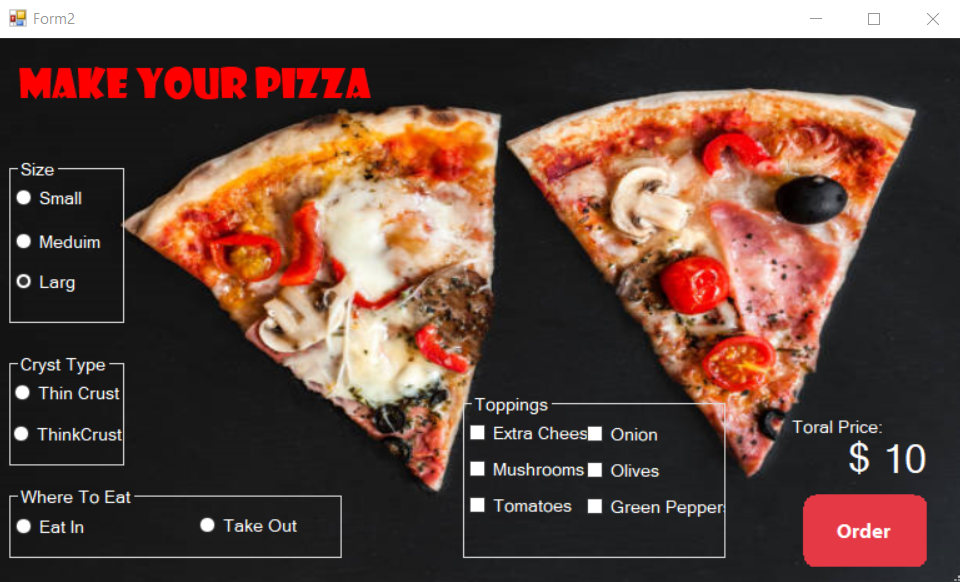
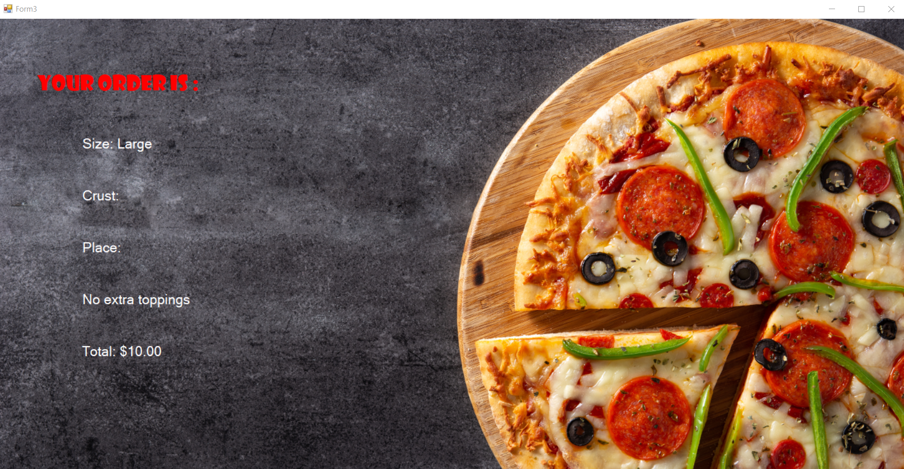

# 🍕 Pizza Ordering App - Windows Forms (C#)

A simple and functional Windows Forms application written in C# that allows users to customize and place a pizza order. Users can select the size, crust type, toppings, and dining option. A final summary with the total price is displayed.

---

## 📷 Screenshots

### 🧾 Order Form

### ✅ Summary Form

*Note: Replace these images with real screenshots after uploading them to the `screenshots` folder in your project.*

---

## 🚀 Features

- Choose pizza size: Small, Medium, Large
- Select crust type: Thin or Thick
- Dining options: Eat In or Take Out
- Add toppings: Extra Cheese, Mushrooms, Olives, Tomatoes, Onions, Green Peppers
- Live price calculation based on selections
- Display a clean and clear order summary in a separate form

---

## 🛠 Technologies Used

- C#
- Windows Forms
- .NET Framework
- Visual Studio

---

## 🗂 Project Structure

- `Form1.cs` – Start screen with “Order Now” button
- `Form2.cs` – Main order form (size, crust, toppings, etc.)
- `Form3.cs` – Summary form that shows the final order
- `PizzaOrder.cs` – Model class to pass order data
- `UIHelper.cs` – Helper for custom button styles (rounded orange buttons)

---

## 🚀 How to Run

1. Clone the repository or download the source code.
2. Open the project in **Visual Studio**.
3. Build the solution (`Ctrl + Shift + B`).
4. Run the app (`F5`) and place your order 🍕.

---

## 👨‍💻 Developer

Developed by **Hasan**  
[GitHub Profile](https://github.com/enhasan9907)